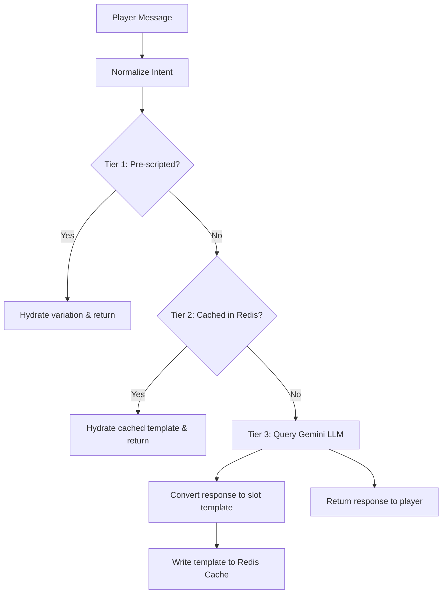

# Codebase Reference Map: Console 911

This reference provides a directory map, architecture description, state mechanisms, and API protocols for **Console 911**. Read this file first before searching symbols or initiating large edits.

---

## 1. Core Architecture

Console 911 is a Next.js single-page application representing a retro emergency dispatcher CRT terminal. It runs a 3-Tier hybrid lookup model designed to keep LLM token costs minimal.

---

## 2. Directory Layout & Components

* **`app/page.tsx`**: Main entrypoint. Controls core game state progression (`gameState`: `'start' | 'loading' | 'playing' | 'feedback' | 'summary'`).
* **`components/`**: Modular views rendered inside the CRT terminal container:
  * **[StartScreen.tsx](file:///C:/Users/My%20PC/Documents/Projects/console-911/components/StartScreen.tsx)**: Handles registration and dispatcher callsign entry.
  * **[PlayingScreen.tsx](file:///C:/Users/My%20PC/Documents/Projects/console-911/components/PlayingScreen.tsx)**: Main gameplay canvas. Includes live scrolling transcript, command input prompt, active line status indicators, and the dispatcher routing panel.
  * **[FeedbackScreen.tsx](file:///C:/Users/My%20PC/Documents/Projects/console-911/components/FeedbackScreen.tsx)**: Displays the post-incident outcome card (Success, Minor Error, Critical Failure), dialogue/dispatch subscores, and detail logs.
  * **[SummaryScreen.tsx](file:///C:/Users/My%20PC/Documents/Projects/console-911/components/SummaryScreen.tsx)**: Renders final stats, rank certificates, and the global high scores leaderboard.

* **`lib/`**: Core helper routines:
  * **[hydration.ts](file:///C:/Users/My%20PC/Documents/Projects/console-911/lib/hydration.ts)**: Picks random slot values on call start and hydrates dialogue variations.
  * **[intent.ts](file:///C:/Users/My%20PC/Documents/Projects/console-911/lib/intent.ts)**: Groups synonym dispatcher queries into canonical keys (e.g. `ASK_LOCATION`, `ASK_BREATHING`).
  * **[redis.ts](file:///C:/Users/My%20PC/Documents/Projects/console-911/lib/redis.ts)**: Handles sorted set (`zadd`/`zrange`) leaderboard queries, with local in-memory fallbacks.
  * **[scenarios.ts](file:///C:/Users/My%20PC/Documents/Projects/console-911/lib/scenarios.ts)**: Loads scenario JSON assets from disk and selects unique archetypes.

* **`app/api/`**: Next.js route handlers:
  * **[session/route.ts](file:///C:/Users/My%20PC/Documents/Projects/console-911/app/api/session/route.ts)**: Supplies the pool of 5 scenarios at the start of a shift.
  * **[chat/route.ts](file:///C:/Users/My%20PC/Documents/Projects/console-911/app/api/chat/route.ts)**: Computes normalizations, checks caches, triggers Gemini fallbacks, and writes back templates.
  * **[leaderboard/route.ts](file:///C:/Users/My%20PC/Documents/Projects/console-911/app/api/leaderboard/route.ts)**: Syncs scoreboard entries.

---

## 3. Session State & Routing Protocols

### Game Loop States
* **Call Index**: Loops from `0` to `calls.length - 1` (up to 5 calls per shift).
* **Turns**: Stricly capped at 10 turns per call. Warning signs (`⚠️ LINE TIMEOUT IMMINENT`) flash on Turns 8 and 9. At Turn 10, the call forcibly terminates with a timeout penalty.
* **Dialogue History**: Sent along with each chat query to ensure the Gemini model has accurate context during fallback generation.
* **Consistent Slots**: Random values chosen for slots like `{caller_name}`, `{address_location}`, and `{victim_relation}` are fixed for the duration of a single call session, ensuring story coherence.
