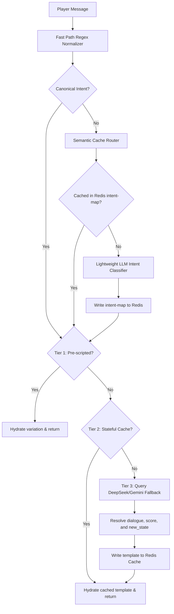

# Codebase Reference Map: Console 911

This reference provides a directory map, architecture description, state mechanisms, and API protocols for **Console 911**. Read this file first before searching symbols or initiating large edits.

---

## 1. Core Architecture

Console 911 is a Next.js single-page application representing a retro emergency dispatcher CRT terminal. It runs a state-aware 3-Tier hybrid lookup model designed to keep LLM token costs minimal.

---

## 2. Directory Layout & Components

- **`app/page.tsx`**: Main entrypoint. Controls core game state progression (`gameState`: `'start' | 'loading' | 'playing' | 'feedback' | 'summary'`).
- **`components/`**: Modular views rendered inside the CRT terminal container:
  - **[StartScreen.tsx](file:///C:/Users/My%20PC/Documents/Projects/console-911/components/StartScreen.tsx)**: Handles registration and dispatcher callsign entry.
  - **[PlayingScreen.tsx](file:///C:/Users/My%20PC/Documents/Projects/console-911/components/PlayingScreen.tsx)**: Main gameplay canvas. Includes live scrolling transcript, command input prompt, active line status indicators, and the dispatcher routing panel.
  - **[FeedbackScreen.tsx](file:///C:/Users/My%20PC/Documents/Projects/console-911/components/FeedbackScreen.tsx)**: Displays the post-incident outcome card (Success, Minor Error, Critical Failure), dialogue/dispatch subscores, and detail logs.
  - **[SummaryScreen.tsx](file:///C:/Users/My%20PC/Documents/Projects/console-911/components/SummaryScreen.tsx)**: Renders final stats, rank certificates, and the global high scores leaderboard.

- **`lib/`**: Core helper routines:
  - **[hydration.ts](file:///C:/Users/My%20PC/Documents/Projects/console-911/lib/hydration.ts)**: Resolves dynamic, state-aware scenario templates, ensuring consistent slot randomizations are maintained.
  - **[intent.ts](file:///C:/Users/My%20PC/Documents/Projects/console-911/lib/intent.ts)**: Groups simple, fast-path synonym dispatcher queries into canonical keys.
  - **[redis.ts](file:///C:/Users/My%20PC/Documents/Projects/console-911/lib/redis.ts)**: Handles sorted set (`zadd`/`zrange`) leaderboard and cache queries. Conditionally switches to a Mock Local Filesystem Cache (`data/local_cache.json`) when `DEV_MODE=Y` is active.
  - **[scenarios.ts](file:///C:/Users/My%20PC/Documents/Projects/console-911/lib/scenarios.ts)**: Loads split scenario JSON assets dynamically from the `data/scenarios/` directory.

- **`app/api/`**: Next.js route handlers:
  - **[session/route.ts](file:///C:/Users/My%20PC/Documents/Projects/console-911/app/api/session/route.ts)**: Supplies the pool of 5 scenarios at the start of a shift.
  - **[chat/route.ts](file:///C:/Users/My%20PC/Documents/Projects/console-911/app/api/chat/route.ts)**: Computes normalizations, checks caches, triggers Gemini fallbacks, and writes back templates.
  - **[leaderboard/route.ts](file:///C:/Users/My%20PC/Documents/Projects/console-911/app/api/leaderboard/route.ts)**: Syncs scoreboard entries.

---

## 3. Session State & Routing Protocols

### Game Loop States

- **Call Index**: Loops from `0` to `calls.length - 1` (up to 5 calls per shift).
- **Turns**: Stricly capped at 10 turns per call. Warning signs (`⚠️ LINE TIMEOUT IMMINENT`) flash on Turns 8 and 9. At Turn 10, the call forcibly terminates with a timeout penalty.
- **Dialogue History**: Sent along with each chat query to ensure the LLM has accurate context during fallback generation.
- **Consistent Slots**: Random values chosen for slots like `{caller_name}`, `{address_location}`, and `{victim_relation}` are fixed for the duration of a single call session, ensuring story coherence.
- **Hidden Caller State**: React tracks the caller's hidden narrative state (`currentState` initialized to `'initial'`), which is submitted with each chat turn. Valid states and transitions are defined in the scenario schema.

### Semantic Intent Cache Router & LLM fallbacks

- **Fast Path**: Direct simple matches (e.g. "where are you") resolve immediately via regex.
- **Semantic Router**: If not matched directly, the input is simplified (stripping punctuation and stop-words via the `stopword` library + custom overrides).
  - The router checks Redis for a mapped intent slug (`intent-map:${message_slug}`).
  - On a miss, a lightweight LLM classifier categorizes the message into a canonical intent, which is cached in Redis so subsequent variations share the same mapping at $0 cost.
- **Stateful Dialogue Caching (Tier 2)**: Caches are keyed off the caller state: `cache:${scenarioId}:${currentState}:${intent}`.
- **Stateful LLM Fallback (Tier 3)**: DeepSeek-V4-Flash evaluates dialog, chooses state transitions (`new_state`) from the scenario's valid states schema, and calculates score deltas.

### 4. Offline Development Cache (`DEV_MODE`)

When `DEV_MODE=Y` is enabled in `.env.local`, the application bypasses Upstash Cloud Redis connection pools. Instead, a mock Redis implementation (`lib/redis.ts`) automatically intercepts calls and stores all caching keys, session intent maps, and high scores on disk inside a git-ignored JSON file at `data/local_cache.json`. This provides zero-cost, zero-setup offline game mechanics that mimic production Redis.
